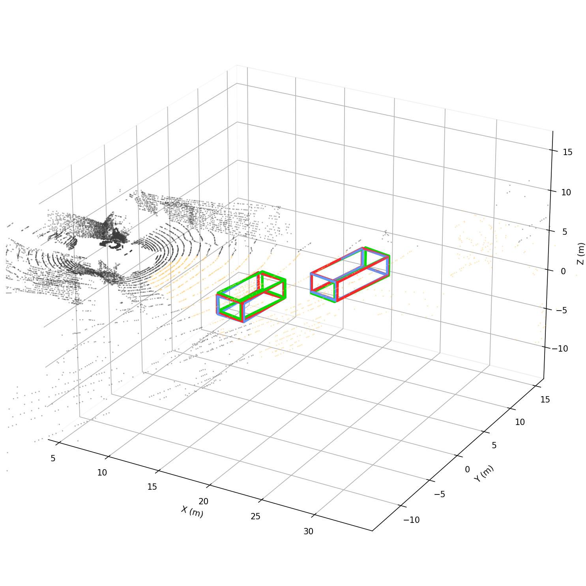
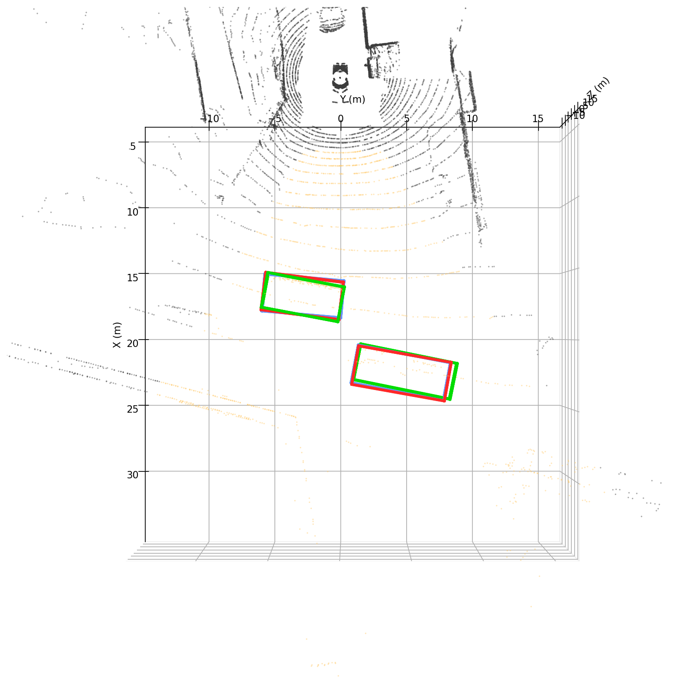
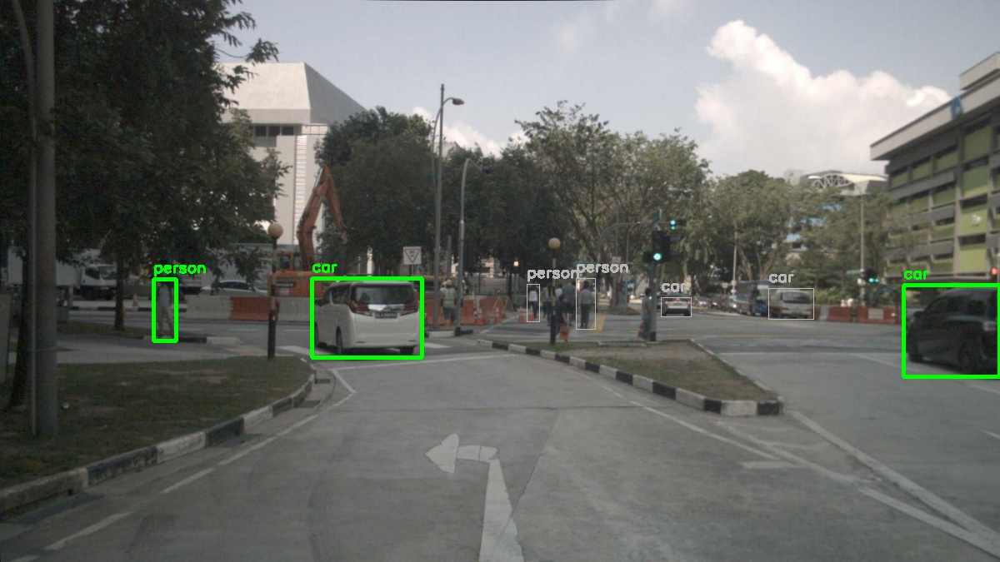
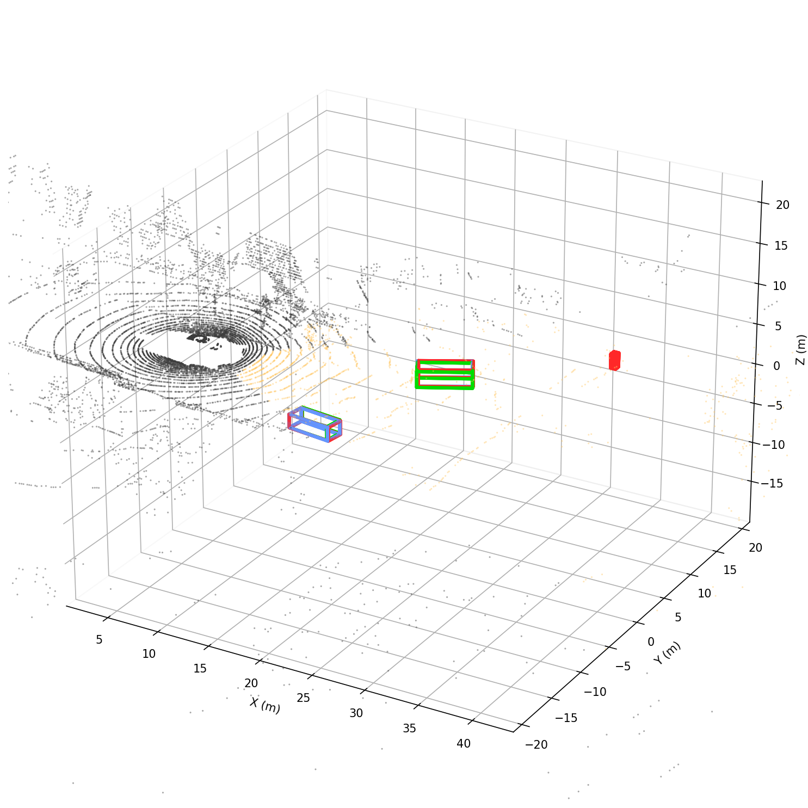
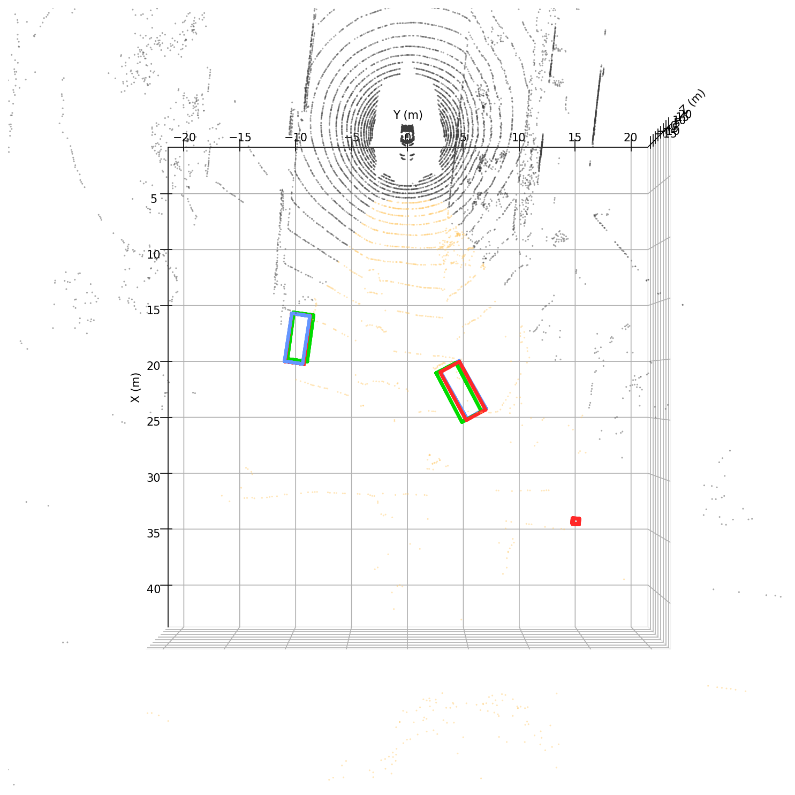
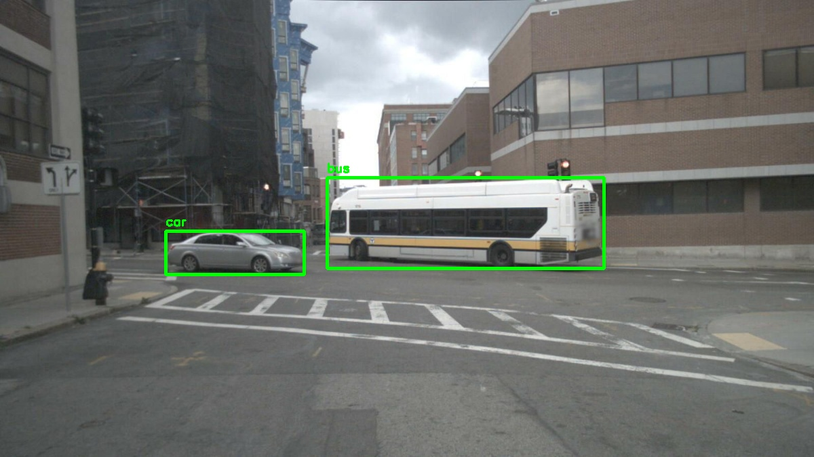
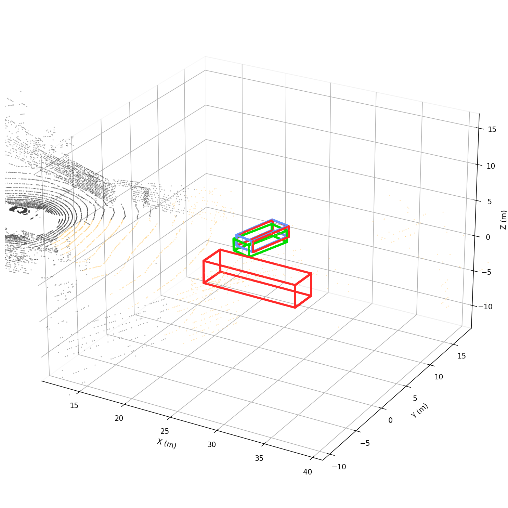
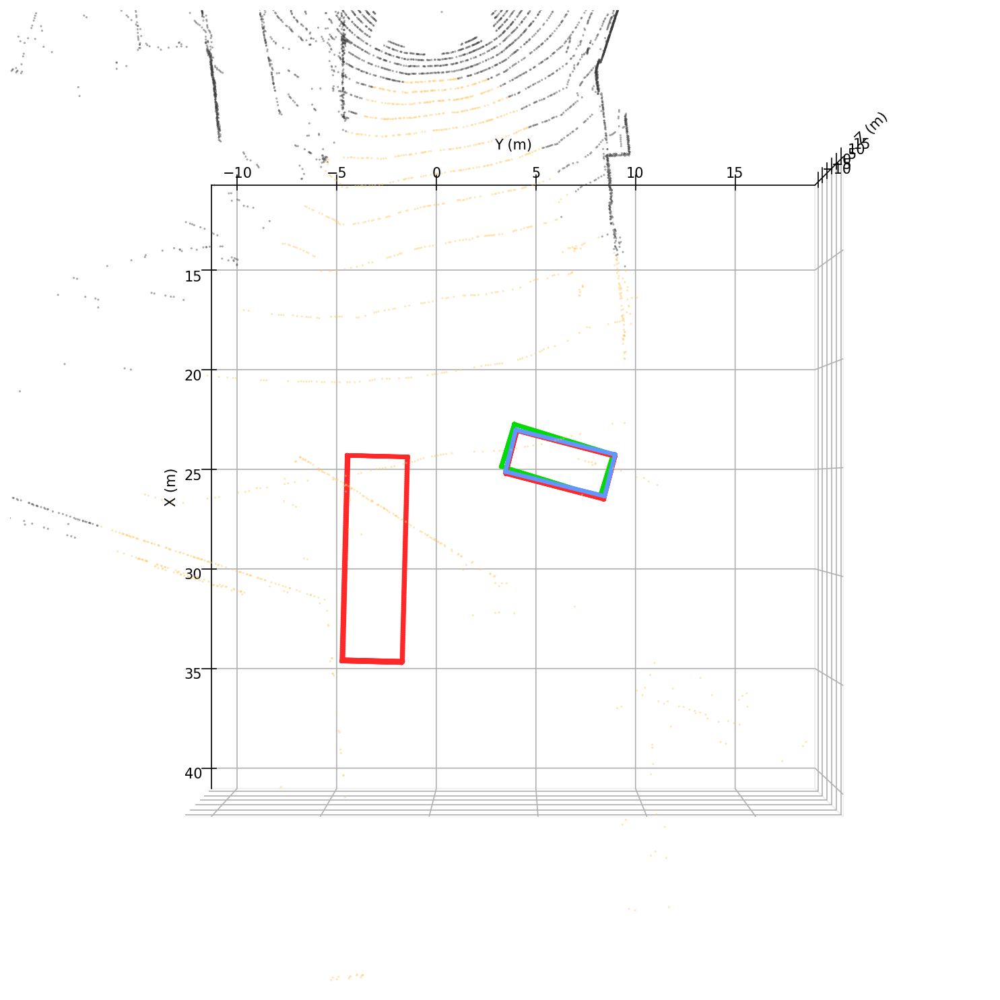

# Cross-Modal 3D Bounding Box Refinement

基于 PointNet++ 和跨模态注意力的 3D 检测框精修。给定 YOLO 2D 检测框 + LiDAR 点云，回归该物体的 3D bbox 残差（中心、尺寸、朝向）。

**数据集**: nuScenes v1.0-mini（CAM_FRONT + LIDAR_TOP）

## 模型

| 模型 | 参数量 | 输入 | 说明 |
|------|--------|------|------|
| **C2** (LidarOnlyRefiner) | 191K | LiDAR only | **主线模型**，3×SA → mean pool → MLP |
| C1 (ImageOnlyRefiner) | 83K | RGB only | 纯 2D 基线，Lightweight2DExtractor → pool → MLP |
| C3 (CrossModalFusion) | 2.8M | RGB + LiDAR | 融合模型，三阶段 cross-attention（实验性） |

C2 与 C3 在当前数据上性能差距在 GT 噪声范围内，C2 性价比最高。

| 指标 | C2 (191K) | C3 (2.8M) |
|------|-----------|-----------|
| Center err | 0.460m | 0.441m |
| Size err | 0.120m | 0.114m |
| Yaw err | 4.40° | 4.54° |

## 数据流

```
CAM_FRONT (1600×900) + LIDAR_TOP (N×5)
    │
    ├─ YOLO26s → 2D bboxes
    ├─ LiDAR 投影 → bbox 内 3D 点提取
    ├─ GT 匹配（2D 中心距离）
    └─ 对每个物体:
        点云 → 去中心化 + 旋转对齐 → extent 归一化 → FPS(256)
        目标: 8 维残差 [Δx,Δy,Δz, Δw,Δl,Δh, sin(Δθ), cos(Δθ)]
```

训练时对 GT 加噪声（center±0.3m, size±0.15m, yaw±5°），模型学习 noisy→GT 的残差。

### Extent 自适应归一化

不同物体尺度差异大（行人 0.5m vs 卡车 10m），用点云半跨度自适应缩放，使 SA 半径工作在相对单位。

## 可视化 (C2 在 nuScenes 上的推理结果)

**图例**: 橙色点 = CAM_FRONT FOV 内 LiDAR, 深灰点 = FOV 外, 绿色框 = GT, 蓝色框 = 噪声输入, 红色框 = C2 预测

### Frame 01 (卡车 + 轿车)

| 2D 检测 (CAM_FRONT) | 3D 点云 + bbox (透视图) | 3D 俯视图 |
|:---:|:---:|:---:|
|  |  |  |

### Frame 02 (两轿车 + 行人)

| 2D 检测 (CAM_FRONT) | 3D 点云 + bbox (透视图) | 3D 俯视图 |
|:---:|:---:|:---:|
|  |  |  |

### Frame 03 (巴士 + 轿车)

| 2D 检测 (CAM_FRONT) | 3D 点云 + bbox (透视图) | 3D 俯视图 |
|:---:|:---:|:---:|
|  |  |  |

> 每个物体的局部 PLY 见 `display/frame_XX/obj_*.ply`, 用 CloudCompare 打开即可自动对焦到该物体。

## 快速开始

```bash
# 训练 C2
python scripts/train_phase2.py

# 训练 C3
python scripts/train_phase2.py --model_type fusion

# 断点续训
python scripts/train_phase2.py --resume checkpoints_phase2/lidar_only.pt

# 可视化
python scripts/visualize_c2.py
```

## 文件结构

```
├── src/
│   ├── fusion.py           # C1/C2/C3 模型定义
│   ├── model.py            # PointNet++ FPS / Ball Query / Set Abstraction
│   ├── dataset_phase2.py   # 数据集: YOLO检测 → crop → 噪声 → 残差
│   ├── dataset_phase1.py   # LiDARProjector, 坐标变换
│   ├── detector.py         # YOLO26s ONNX 推理
│   ├── loss.py             # SmoothL1 + MSE(sin/cos)
│   └── metrics.py          # center(m) / size(m) / yaw(°)
├── scripts/
│   ├── train_phase2.py     # 训练 (C1/C2/C3, resume)
│   └── visualize_c2.py     # C2 推理可视化 (整帧 LIDAR + 3D bbox PLY)
├── checkpoints_phase2/
│   ├── lidar_only.pt       # C2 epoch 19
│   └── fusion.pt           # C3 epoch 23
├── docs/design.md          # 详细设计文档
├── log/                    # 实验记录与决策
└── models/yolo26s.onnx     # YOLO 检测模型
```
