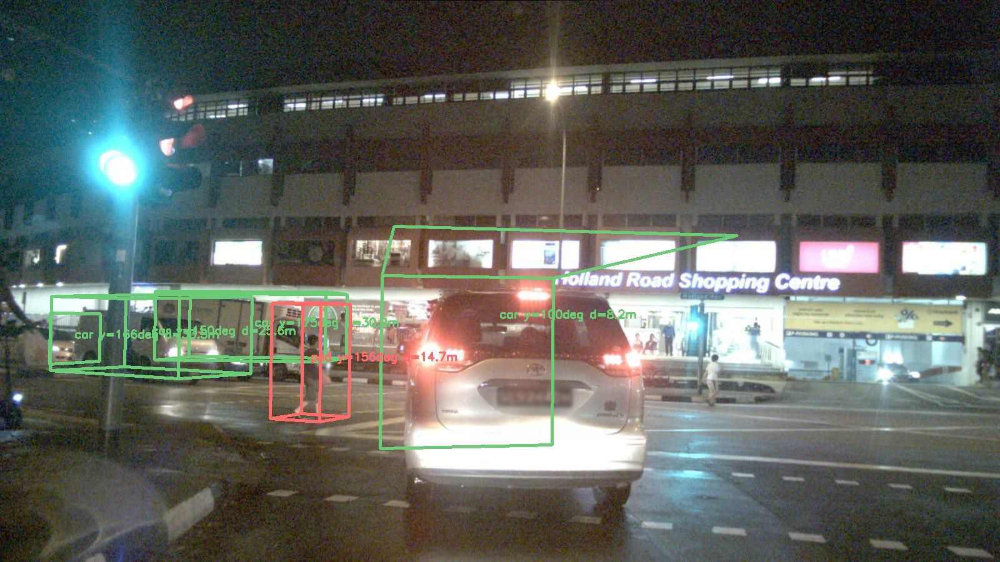
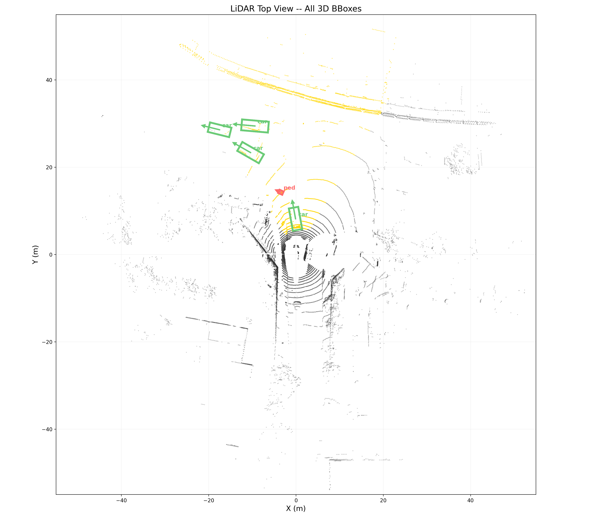
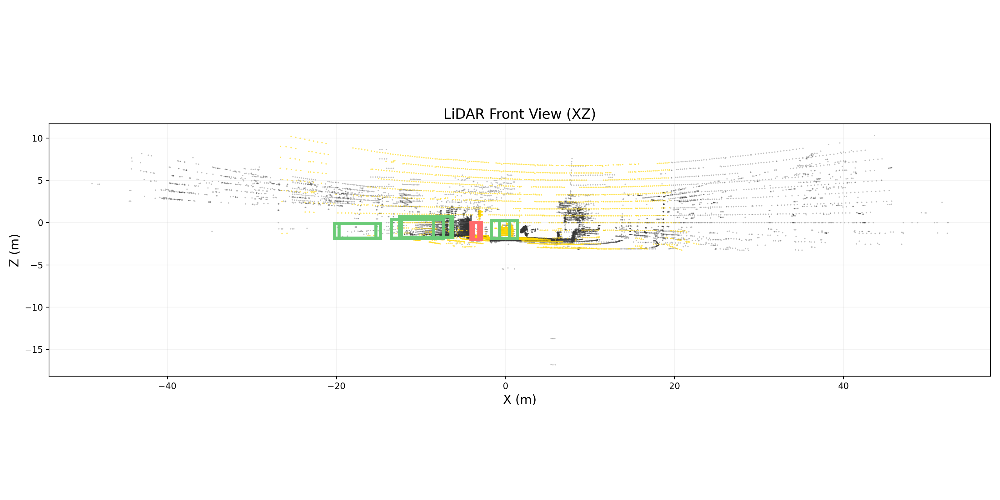
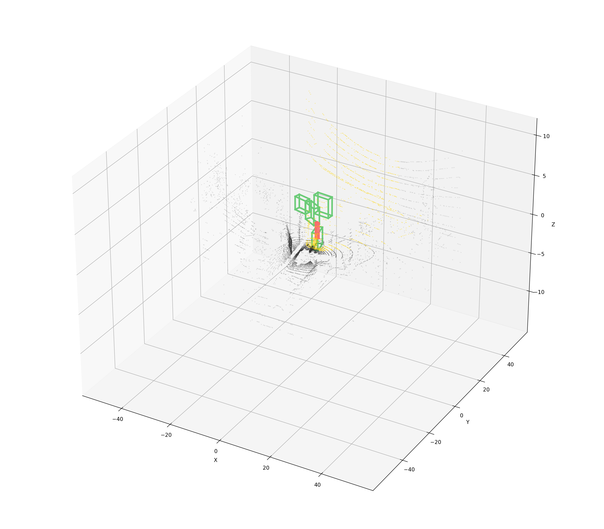

# Cross-Modal 3D Bounding Box Refinement

基于 PointNet 的 3D 检测框精修。给定 YOLO 2D 检测框 + LiDAR 点云，回归物体的 3D bbox（中心、尺寸、朝向）。

**数据集**: nuScenes v1.0-mini（CAM_FRONT + LIDAR_TOP）

## 模型

| 模型 | 参数量 | 输入 | 说明 |
|------|--------|------|------|
| **Phase 3** (PointNet3DDetector) | 51K | LiDAR only | **主线**，绝对回归 [cx,cy,cz,w,l,h,yaw] + face coverage encoder |
| C2 (LidarOnlyRefiner) | 191K | LiDAR only | Phase 2，3×SA → mean pool → MLP，残差回归 |
| C3 (CrossModalFusion) | 2.8M | RGB + LiDAR | Phase 2，三阶段 cross-attention（实验性） |

### Phase 3 指标 (nuScenes v1.0-mini val, 145 cars)

| 指标 | 值 |
|------|-----|
| Center mean/median | 0.25m / 0.15m |
| Size mean | 0.14m |
| Yaw mean/median | 6.6° / **3.2°** |
| Yaw <5° | 65% |
| Yaw <10° | 93% |

## 推理管线

```
CAM_FRONT (1600×900) + LIDAR_TOP (multi-sweep)
    │
    ├─ YOLO → 2D bboxes
    ├─ frustum 裁剪 (bbox → 3D 视锥)
    ├─ ROR 去噪 (统计离群点剔除)
    ├─ DBSCAN 聚类 (取最大簇)
    └─ PointNet3DDetector → [cx,cy,cz, w,l,h, yaw]
```

## 可视化 (GT-bbox 管线, Frame 01)

**图例**: 金色点 = CAM_FRONT FOV 内 LiDAR, 深灰点 = FOV 外, 彩色框 = 模型预测 3D BBox, 箭头 = 朝向.

### YOLO 2D 检测 + 3D BBox 投影



### LiDAR 俯视图 — 所有 3D BBox 同框



### LiDAR 正视图 (XZ)



### 3D 透视图



### 3D 点云 + BBox (PLY)
用 CloudCompare / Meshlab 打开 `docs/images/frame01.ply` 可交互式查看所有 3D BBox 在 LiDAR 点云中的位置。

### 生成可视化

```bash
# GT-bbox 管线 (干净点云, 评估模型上限)
python scripts/visualize_scene.py --num_frames 8

# Frustum 管线 (YOLO→frustum→ROR→DBSCAN→Model, 模拟部署)
python scripts/visualize_infer.py --num_frames 8
```

输出目录: `display/multi_frame/` (GT-bbox) 和 `display/infer_frustum/` (frustum)。

## 快速开始

```bash
# Phase 3 训练
python scripts/train_phase3.py --epochs 80

# Phase 3 预处理 (多帧聚合 + 地面去除)
python scripts/preprocess_phase3.py --nsweeps 5

# 可视化
python scripts/visualize_scene.py --num_frames 8
python scripts/visualize_infer.py --num_frames 8
```

## 文件结构

```
├── src/
│   ├── fusion.py              # PointNet3DDetector + face coverage encoder
│   ├── inference.py            # Frustum 推理管线
│   ├── loss.py                 # Center + Size + Yaw(cos2θ) 损失
│   ├── dataset_phase3.py       # Phase3 数据集 + frustum 混合训练
│   ├── dataset_phase2.py       # Phase2 数据集 (残差回归)
│   ├── dataset_phase1.py       # LiDARProjector, 坐标变换
│   ├── detector.py             # YOLO 检测器 (ONNX / PT)
│   ├── ground_removal.py       # RANSAC 地面去除
│   ├── init_estimator.py       # 2D→3D 初始化
│   ├── model.py                # PointNet++ FPS / Ball Query / SA
│   └── metrics.py              # 评估指标
├── scripts/
│   ├── train_phase3.py         # Phase 3 训练
│   ├── train_phase2.py         # Phase 2 训练
│   ├── visualize_scene.py      # GT-bbox 管线可视化
│   ├── visualize_infer.py      # Frustum 管线可视化
│   ├── preprocess_phase3.py    # 数据预处理
│   └── verify_preprocess.py    # 预处理验证
├── config/
│   ├── phase3.yaml             # Phase 3 配置
│   └── phase2.yaml             # Phase 2 配置
└── doc/                        # 设计文档
```

## 坐标帧

详见 `CLAUDE.md`。关键: 所有训练和推理在 **LiDAR 帧** 进行。

nuScenes 尺寸约定: `[width, length, height]`
