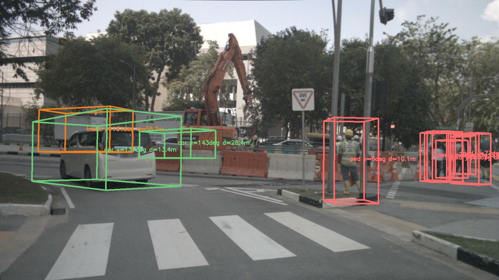
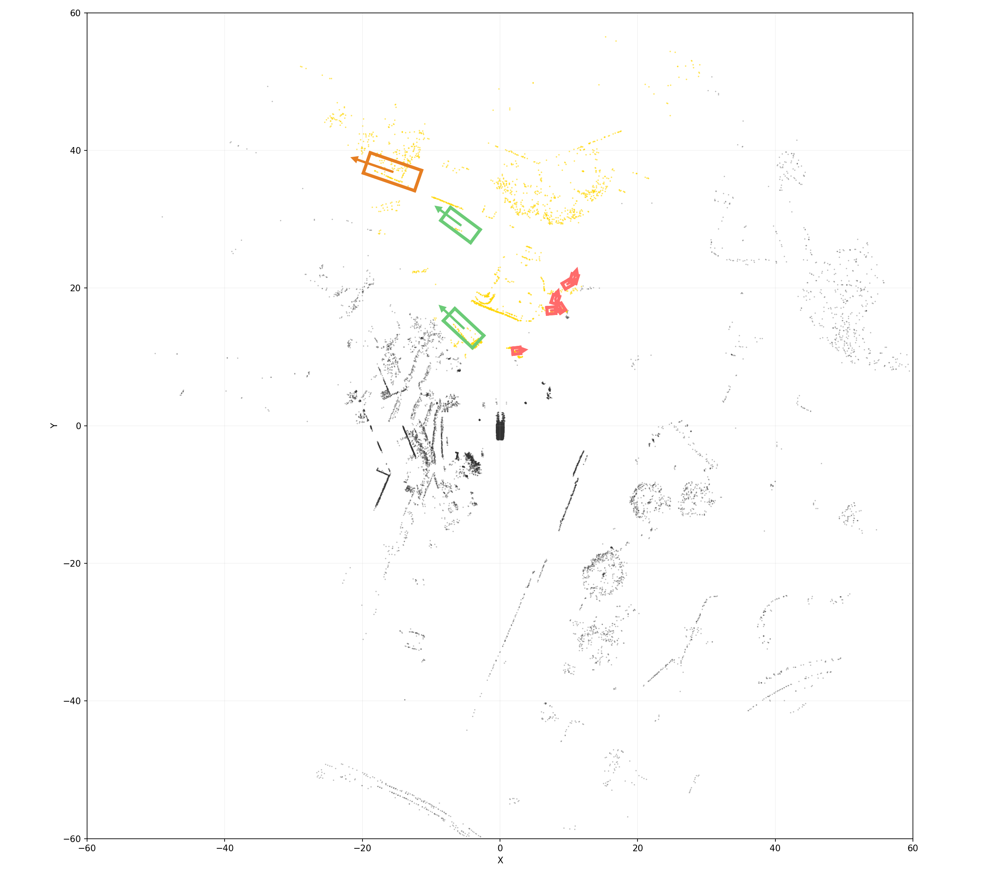
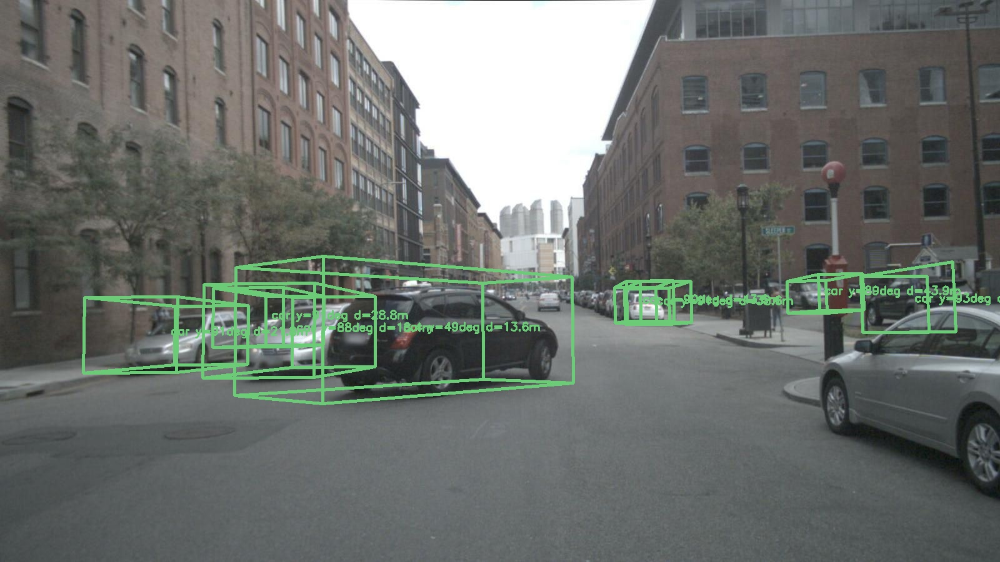
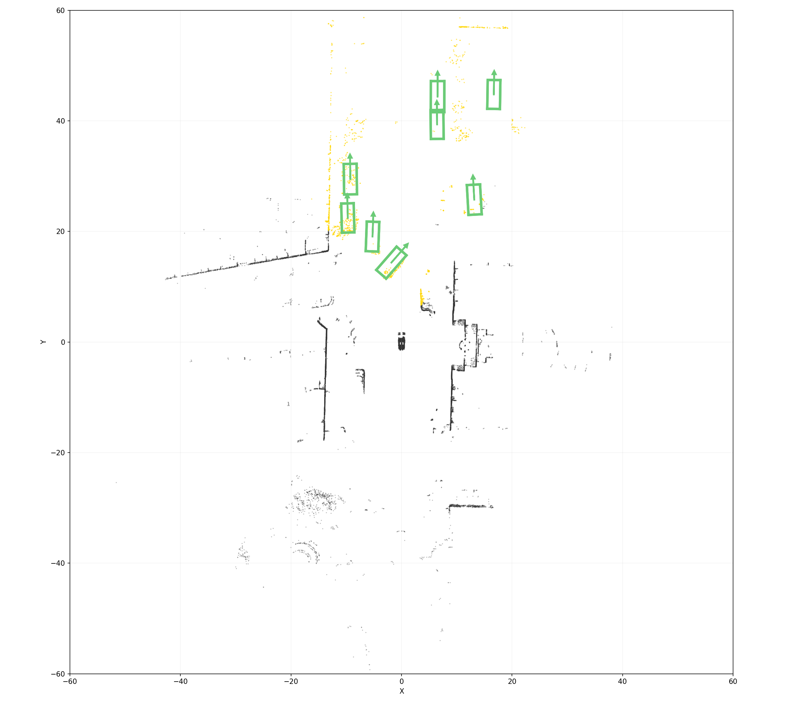
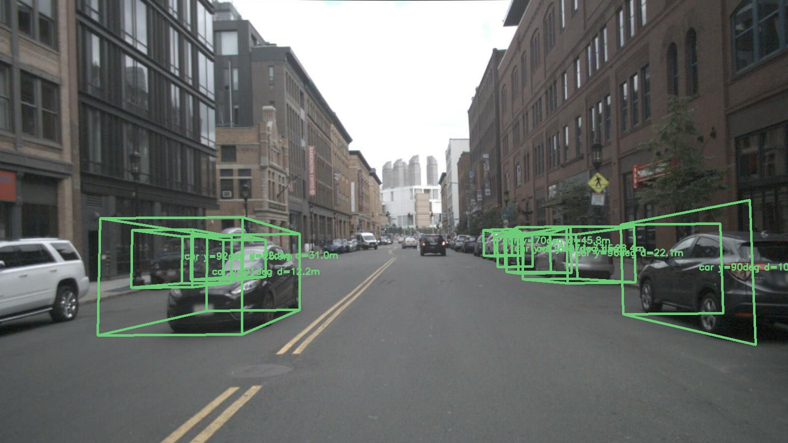
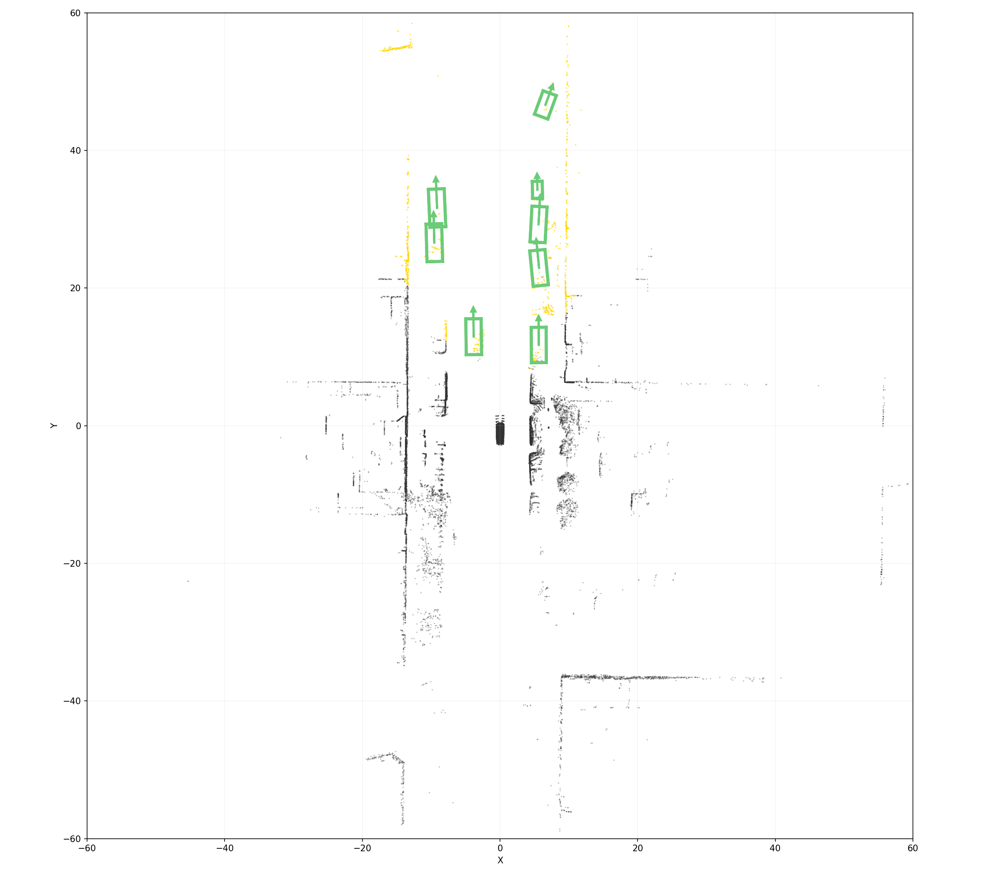

# Cross-Modal 3D Bounding Box Refinement

基于 YOLO 2D 检测 + LiDAR 点云的 3D 目标检测框回归。

**输入**: CAM_FRONT 图像 (1600×900) + LIDAR_TOP 多帧聚合点云
**输出**: 每个检测物体的 3D bbox — 中心 (cx, cy, cz)、尺寸 (w, l, h)、朝向 (yaw)
**数据集**: nuScenes v1.0-mini

## 效果 (Test Set, GT-bbox 管线)

> 图例: 金色 = CAM_FRONT 视锥内 LiDAR, 深灰 = 视锥外, 彩色粗框 = 模型 3D BBox, 箭头 = 朝向.

### Frame 03 — 9 物体 (行人 + 轿车 + 卡车)

| 2D 检测 (YOLO + 3D BBox) | LiDAR 俯视图 |
|:---:|:---:|
|  |  |

### Frame 05 — 8 物体 (多辆轿车)

| 2D 检测 | LiDAR 俯视图 |
|:---:|:---:|
|  |  |

### Frame 07 — 8 物体 (多辆轿车)

| 2D 检测 | LiDAR 俯视图 |
|:---:|:---:|
|  |  |

> CloudCompare/Meshlab 打开 `docs/images/frame03.ply` / `frame05.ply` / `frame07.ply` 交互查看. 更多: `display/test_gt/`.

## Phase 3 (当前主线)

### 模型: PointNet3DDetector

| 项目 | 说明 |
|------|------|
| 参数量 | ~51K |
| 输入 | 512 个 LiDAR 点 (物体局部坐标) |
| 输出 | [dx, dy, dz, δw, δl, δh, cos2θ, sin2θ] |
| 骨干 | PointNet (3→64→128 + MaxPool, 128-dim 全局特征) |
| 几何特征 | prior (16) + centroid (16) + extent/prior (16) + viewdir (16) + face_coverage (16) |
| 融合维度 | 208 |
| 头结构 | center: 208→128→64→3 / size: 208→64→3 / yaw: 208→64→2 |

**Face Coverage**: 计算物体 6 个面的点云覆盖率 → 模型知道哪个面最完整 → 推断中心偏移方向.

### 数据管线

```
每帧:
  1. 加载预处理的 LiDAR 点云 (5-sweep 聚合 + RANSAC 地面去除)
  2. YOLO 检测 CAM_FRONT → 2D bbox
  3. GT 3D bbox 中心投影到 2D → 匹配 YOLO bbox → 确定 class_id
  4. GT bbox 内部点提取 (+ 跨帧累积 4 帧同 instance 的点)
  5. 30% 概率用 frustum 管线替换 GT-bbox 点 (YOLO bbox→视锥→ROR→DBSCAN)
  6. 采样到 512 点, 随机 Z 轴旋转增强
  7. 计算 face_coverage
  8. 构建 target: d_center = (gt_center - centroid)/3.0, d_size = log(gt_size/prior)
```

### 损失

| 项 | 公式 | 权重 |
|----|------|------|
| Center | SmoothL1(d_center_pred, d_center_gt) | 4.0 |
| Size | MSE(d_size_pred, d_size_gt) | 0.3 |
| Yaw | 1 − cos(2Δθ) (person 类跳过) | 0.3 |

### 指标 (nuScenes mini val, 145 cars)

| 指标 | 值 |
|------|-----|
| Center median | 0.15m |
| Yaw median | **3.2°** |
| Yaw < 5° | 65% |
| Yaw < 10° | 93% |

### 推理管线

```
CAM_FRONT → YOLO → 2D bboxes
LIDAR_TOP → 多帧聚合 → 地面去除 → 全景点云
                         │
每个 YOLO bbox:
  1. frustum 裁剪 (bbox → 3D 视锥射线, 自适应 margin)
  2. ROR 去噪 (Open3D statistical outlier removal)
  3. DBSCAN 聚类 → 取最大簇
  4. 采样 512 点 → PointNet3DDetector
  5. 解码: center = centroid + d_center×3.0, size = prior×exp(d_size)×1.12
```

## Phase 2 (残差回归, 参考)

C2 (191K) / C3 (2.8M) 使用 PointNet++ Set Abstraction + 残差回归. 详见 `config/phase2.yaml`.

## 项目结构

```
├── src/
│   ├── fusion.py              # PointNet3DDetector (Phase 3) + C1/C2/C3 (Phase 2)
│   ├── dataset_phase3.py       # Phase 3 数据集: 多帧/地面去除/frustum混合训练/face_coverage
│   ├── dataset_phase2.py       # Phase 2 数据集: YOLO→LiDAR投影→残差
│   ├── dataset_phase1.py       # 共用: LiDARProjector + 坐标变换
│   ├── inference.py            # Frustum 推理管线 (YOLO→视锥→ROR→DBSCAN→Model)
│   ├── loss.py                 # PointNet3DLoss (Phase 3) + BboxRefinementLoss (Phase 2)
│   ├── metrics.py              # 评估指标 (Phase 2 残差 / Phase 3 绝对回归)
│   ├── detector.py             # YOLO 检测器 (onnx 推理 + pt 加载)
│   ├── ground_removal.py       # RANSAC 地面去除 + 多帧 LiDAR 聚合
│   ├── init_estimator.py       # 2D→3D 初始化 (PCA yaw / plane fitting)
│   ├── model.py                # PointNet++ FPS / Ball Query / Set Abstraction (Phase 2 用)
│   ├── __init__.py
│   └── new_model_arch.md       # Phase 3 架构设计文档
├── scripts/
│   ├── train_phase3.py         # Phase 3 训练入口
│   ├── visualize_scene.py      # GT-bbox 可视化 (干净点云, 评估模型上限)
│   ├── visualize_infer.py      # Frustum 推理可视化 (YOLO+视锥, 模拟部署)
│   ├── visualize_c2.py         # Phase 2 C2 可视化
│   ├── preprocess_phase3.py    # 离线预处理: 多帧聚合 + 地面去除 → .npy
│   ├── gen_readme_imgs.py      # 生成 README 展示图
│   ├── train_phase2.py         # Phase 2 训练入口
│   ├── compare_c1c2c3.py       # Phase 2 模型对比 (C1/C2/C3)
│   └── compare_c2c3.py         # Phase 2 模型对比 (C2/C3)
├── config/
│   ├── phase3.yaml             # Phase 3 训练参数
│   └── phase2.yaml             # Phase 2 训练参数
├── doc/                        # 设计文档
├── docs/images/                # README 效果截图
├── CLAUDE.md                   # 坐标帧约定 + 已知陷阱
├── requirements.txt
└── display/                    # 可视化输出 (gitignored)
```

## 快速开始

```bash
# 预处理 (仅首次)
python scripts/preprocess_phase3.py --nsweeps 5

# 训练
python scripts/train_phase3.py --epochs 80

# GT-bbox 可视化 (模型上限评估)
python scripts/visualize_scene.py --num_frames 8

# Frustum 推理可视化 (模拟真实部署)
python scripts/visualize_infer.py --num_frames 8
```

输出: `display/multi_frame/` (GT-bbox), `display/infer_frustum/` (frustum).

## 坐标约定

所有计算在 **LiDAR 帧** 进行. nuScenes 尺寸: `[width, length, height]`. 详见 `CLAUDE.md`.
